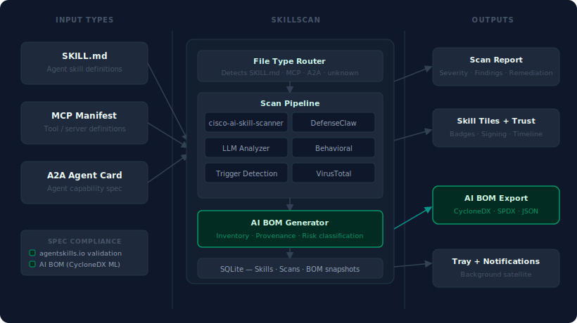

# SkillScan v2 — Architecture

> This document supersedes `Architecture.md` (v1 tray app).
> v2 transforms SkillScan from a system tray utility into a full **Skill Security Environment** — a windowed application for authoring, auditing, inventorying, and governing every AI skill, MCP manifest, and A2A agent card on the machine.
>
> Run: `.venv\Scripts\python -m skill_scan`

---

## Concept

The v1 tray app excelled at reactive scanning (drag-drop, clipboard, folder watch). v2 keeps all of that in the background and adds the proactive layer: a primary window where you can see, create, and understand every AI skill on the machine. The tray icon is retained as a satellite entry point for notifications and background triggers, but it is no longer the primary UX.

Three layers of capability:

| Layer | Question answered |
|---|---|
| **Security** (scan pipeline) | Is this skill safe to run? |
| **Inventory** (AI BOM) | What AI components do I have, where did they come from? |
| **Authoring** (Skill Creator) | Does this new skill conform to spec and pass before I deploy it? |

---

## Main Window Layout


The window is **frameless and borderless** — no native Windows chrome. Custom title bar carries the SKILLSCAN two-colour wordmark, a Segoe Fluent Icons minimise and close only (no maximise). Draggable via `mousePressEvent` / `mouseMoveEvent` on the title bar. Drop shadow via `QGraphicsDropShadowEffect` (blur 28, offset 0,6).

### Chrome geometry

| Zone | Width | Notes |
|---|---|---|
| Title bar | full × 40px | `#1E293B`, drag region, WM buttons right-aligned |
| Nav rail | 56px | `#1E293B`, icon + 8px label, active item has 3px left accent bar |
| Folder sub-pane | 185px (resizable) | `#111827`, folder list + stats |
| Main content | flex-grow | `#0F172A`, view-specific pane |
| Status bar | full × 24px | `#1E293B`, scanner state, unscanned count, LLM model, version |

### Nav rail items

`QStackedWidget` index, in registration order (`main_window._register_views()`):

| # | Item | Description |
|---|---|---|
| 0 | Dashboard | Card-grid overview — hero metrics, integration/AI module health, security posture, action items, etc. |
| 1 | Folders | Primary view — folder list + skill tiles |
| 2 | Inventory | Table view of all tracked skills (AI BOM source) — stub, Phase 9 |
| 3 | Skill Studio | `SkillManagerView` — package/validate/remediate skill content against the agentskills.io spec |
| 4 | Testing | Eval test-skill download/management |
| 5 | Activity Log | Filterable scan/trust event history |
| 6 | Prompt Builder | Stub — compose/template/test prompts against the configured LLM |
| 7 | Amalgamator | Stub — merge multiple skills into one consolidated skill |
| 8 | Skill Competence | Stub — bundle skills, have Claude build a demo app using all of them |
| 9 | Options | Embedded `OptionsView` — also reachable as a floating, titlebar-less window via `options_window.py` (tray-triggered). Every page autosaves on each discrete change (toggle/combo/field commit); no manual Save button in either context |
| 10 | About | About page |
| 11 | Skill Detail | Pushed onto the stack (not in the rail) when a tile/row is opened; back-history managed by `main_window` |

Burger hover menu (not the rail itself) groups items into core views / AI views / Options+About+Exit, since the rail only surfaces a subset directly.

Active item: `#0D9488` icon + label, `rgba(13,148,136,0.12)` background, 3px left border bar in `#0D9488`.

---

## Component Architecture



### Input types

SkillScan v2 recognises three AI component file types:

| Type | Detection | Scanner used |
|---|---|---|
| **SKILL.md** | Filename match `SKILL.md` | `cisco-ai-skill-scanner` + DefenseClaw + LLM |
| **MCP Manifest** | JSON file containing `"mcpVersion"` or `"tools"` array at root | Adapted pipeline; triggers tool-description injection checks |
| **A2A Agent Card** | JSON at `agent.json` or `.well-known/agent.json` with `"capabilities"` key | Adapted pipeline; checks capability scope and permission escalation |

The **File Type Router** (`core/router.py`) inspects each path before dispatching to the scan pipeline. Unknown file types are flagged but not scanned.

### Scan pipeline (per component)

Analyzers run in parallel where possible; results are merged into a single `ScanResult`:

1. `cisco-ai-skill-scanner` — static + trigger detection (always enabled for SKILL.md)
2. **DefenseClaw** (`integrations/defenseclaw.py`) — Cisco AI Defense deep analysis
3. **LLM Analyzer** — LiteLLM call with structured prompt; requires API key
4. **Behavioral** — heuristic pattern matching
5. **VirusTotal** — hash lookup for binary attachments; requires API key
6. **Trigger Detection** — explicit trigger/payload pattern matching

### AI BOM Generator

After each scan (or on-demand from the Inventory view), `integrations/aibom.py` generates a BOM entry for the component:

```json
{
  "bomFormat": "CycloneDX",
  "specVersion": "1.6",
  "version": 1,
  "components": [{
    "type": "machine-learning-model",
    "name": "web-search",
    "version": "1.0.0",
    "authors": [...],
    "licenses": [...],
    "externalReferences": [...],
    "properties": [
      { "name": "skillscan:spec_type", "value": "SKILL.md" },
      { "name": "skillscan:scan_severity", "value": "clean" },
      { "name": "skillscan:scan_timestamp", "value": "2026-06-13T..." },
      { "name": "skillscan:trusted", "value": "true" }
    ]
  }]
}
```

Folder-level BOM snapshots aggregate all components in that folder into a single CycloneDX document and are stored in `bom_snapshots` with a timestamp.

---

## Project Structure

Current as of 2026-06-18. `integrations/` (DefenseClaw, AI BOM, agentskills.io spec, MCP/A2A adapter) is still planned — Phase 6+ — and does not exist yet; MCP manifests are currently handled directly inside `core/scanner.py` via `cisco-ai-mcp-scanner`, not a separate adapter module. See [project_files.md](project_files.md) for the full file-by-file inventory.

```
SkillScan/
├── run.ps1, run.bat
├── requirements.txt, requirements-dev.txt
├── evals/                              # eval fixtures (skills/, mcp/, a2a/) for test_skills.py
└── src/skill_scan/
    ├── __init__.py                     # __version__ = "1.0.0"
    ├── __main__.py                     # Entry: QApplication, MainWindow, TrayApp (satellite)
    ├── core/
    │   ├── config.py                   # JSON config; per-provider/per-feature LLM credentials — get_llm_creds()
    │   ├── llm.py                      # LLMJob(QObject) — QThread-based LiteLLM call for in-app (Skill Studio) actions
    │   ├── scanner.py                  # ScanJob — QProcess wrapper around skill-scanner / mcp-scanner
    │   ├── router.py                   # detect_type() — SKILL_MD / MCP_MANIFEST / A2A_CARD / UNKNOWN
    │   ├── db.py                       # SQLAlchemy engine, models, session factory
    │   ├── skill_discovery.py          # walk folders, populate DB, hash-check, trust invalidation
    │   ├── spec_compliance.py          # single source of truth for agentskills.io scoring
    │   ├── script_lint.py              # heuristic checks for scripts/ files
    │   ├── license_registry.py         # data/license_registry.json loader
    │   ├── tool_detector.py            # data/tool_registry.json — installed AI tooling detection
    │   ├── result_store.py             # bounded JSON result history; ScanResult.llm_skipped
    │   ├── clipboard_watcher.py
    │   ├── watcher.py
    │   └── test_skills.py
    ├── data/
    │   ├── license_registry.json
    │   └── tool_registry.json
    ├── ui/
    │   ├── _palette.py                 # SYS_* colour tokens
    │   ├── _widgets.py                 # RoundedCard, TitleBar, SCROLLBAR_STYLE, _DarkMessageBox + msg_*()
    │   ├── _icons.py                   # Font Awesome 6 Free loader — fa()/fa_reg()
    │   ├── _license_picker.py          # LicensePicker — shared by Options + Skill Studio
    │   ├── _status.py                  # AiStatusRoutine — taskbar status dot+text wrappers
    │   ├── _flow_layout.py             # FlowLayout / FlowContainer; reorder_by()
    │   ├── main_window.py              # frameless main window, nav rail, QStackedWidget (12 views)
    │   ├── nav_rail.py                 # NavRail, burger hover menu
    │   ├── options_window.py           # floating Options window — mirrors MainWindow/_MainPanel split, no titlebar/drag/shadow/mask
    │   ├── help_window.py              # floating help window — same shell/panel split; content-free skeleton
    │   ├── test_window.py              # ⚠️ TEMPORARY diagnostic-only — see "Key Design Decisions"; not part of the app
    │   ├── detect_tooling_dialog.py    # "Detect AI Tooling…" picker
    │   ├── scan_progress.py            # frameless scan dialog; AI Security Evaluation button
    │   ├── result_formatter.py         # HTML findings report renderer
    │   ├── toggle_row.py               # pill toggle for QMenu
    │   ├── tray.py                     # satellite tray
    │   └── views/
    │       ├── dashboard_view.py       # card grid, drag-and-drop, edit mode, 60s auto-refresh
    │       ├── dashboard/
    │       │   ├── _base.py            # DashboardWidget base — WIDGET_ID, SIZE, build_content(), refresh()
    │       │   ├── _widgets.py         # 14 widget classes
    │       │   └── __init__.py         # REGISTRY + DEFAULT_LAYOUT
    │       ├── folders_view.py         # FolderPane + SkillTileGrid, FILTER/SORT/SIZE toolbar
    │       ├── skill_tile.py           # SkillTile(QFrame) — severity border, badges, hover overlay
    │       ├── skill_table.py          # QTableWidget alternate list view
    │       ├── skill_detail_view.py    # single skill: Report/History/Raw Output/Compliance tabs
    │       ├── skill_manager_view.py   # Skill Studio — builder UI, AI Review, Optimize Description
    │       ├── inventory_view.py       # ⚠️ stub — Phase 9
    │       ├── testing_view.py
    │       ├── activity_log_view.py
    │       ├── prompt_builder_view.py  # ⚠️ stub
    │       ├── amalgamator_view.py     # ⚠️ stub
    │       ├── skill_competence_view.py# ⚠️ stub
    │       ├── options_view.py         # OptionsView(parent) — search-filterable icon nav, autosave
    │       └── about_view.py
    └── windows/
        ├── taskbar_dock.py             # drag-drop strip docked to the Windows taskbar
        └── context_menu.py             # HKCU Explorer right-click installer
```

---

## Database Schema

SQLite database at `%APPDATA%\SkillScan\skillscan.db`, managed via SQLAlchemy. Existing `results.json` is migrated into `scan_results` on first run.

### `folders`

| Column | Type | Notes |
|---|---|---|
| `id` | INTEGER PK | |
| `path` | TEXT UNIQUE | Absolute path |
| `watch_enabled` | BOOLEAN | Drives FolderWatcher |
| `last_scanned` | DATETIME | Set after "Scan All" completes |
| `added_at` | DATETIME | |

### `skills`

| Column | Type | Notes |
|---|---|---|
| `id` | INTEGER PK | |
| `folder_id` | FK → folders | |
| `path` | TEXT UNIQUE | Absolute path to SKILL.md / manifest |
| `name` | TEXT | Parsed from metadata or filename |
| `spec_type` | TEXT | `skill` / `mcp` / `a2a` / `unknown` |
| `version` | TEXT | From metadata, nullable |
| `authors` | TEXT | JSON array string |
| `license` | TEXT | SPDX identifier or raw string |
| `description` | TEXT | From metadata |
| `file_hash` | TEXT | SHA-256 of file content; invalidates trust on change |
| `trusted` | BOOLEAN | Set true by user after clean scan |
| `trust_signed_at` | DATETIME | When trust was granted |
| `spec_score` | INTEGER | 0–100 agentskills.io compliance |
| `created_at` | DATETIME | First seen by SkillScan |
| `modified_at` | DATETIME | Last file-system modification |

### `scan_results`

| Column | Type | Notes |
|---|---|---|
| `id` | INTEGER PK | |
| `skill_id` | FK → skills | |
| `timestamp` | DATETIME | |
| `severity` | TEXT | `clean` / `low` / `medium` / `high` / `critical` / `unknown` |
| `is_safe` | BOOLEAN | |
| `raw_json` | TEXT | Full scanner output |
| `findings_json` | TEXT | Parsed findings array |
| `duration_ms` | INTEGER | Wall time for full scan pipeline |
| `analyzers_used` | TEXT | JSON array of analyzer names run |
| `returncode` | INTEGER | Exit code |

### `bom_snapshots`

| Column | Type | Notes |
|---|---|---|
| `id` | INTEGER PK | |
| `folder_id` | FK → folders | NULL = whole-library snapshot |
| `created_at` | DATETIME | |
| `format` | TEXT | `cyclonedx-json` / `spdx-json` |
| `content` | TEXT | Full BOM document |

---

## Integration Architecture

### DefenseClaw (`integrations/defenseclaw.py`)

Wraps the `defenseclaw` CLI in a `QProcess` (same pattern as `scanner.py`). Findings are parsed and normalised into the shared `Finding` schema before being merged with `cisco-ai-skill-scanner` output. Enabled via checkbox in Options → Analyzers. Requires `defenseclaw` installed in the same venv.

```
defenseclaw scan <path> --format json
→ stdout JSON → _parse_defenseclaw(stdout) → list[Finding]
→ merged into ScanResult.findings
```

### agentskills.io Spec Validator (`integrations/agentskills_spec.py`)

Downloads the agentskills.io JSON Schema on first use (cached to `%APPDATA%\SkillScan\spec_cache\`). Validates SKILL.md frontmatter fields against the schema using `jsonschema`. Returns a `SpecResult(score: int, missing: list, warnings: list)`. Score drives the compliance badge in Skill Detail view and the `spec_score` DB column.

### MCP / A2A Adapter (`integrations/mcp_a2a.py`)

MCP manifests and A2A agent cards do not use `cisco-ai-skill-scanner` (which expects SKILL.md format). Instead, the adapter:

1. Extracts tool descriptions / capability declarations as text
2. Assembles a synthetic `SKILL.md`-like prompt context
3. Passes it to the LLM Analyzer and Trigger Detector only
4. Returns findings tagged with `source: mcp` or `source: a2a`

### AI BOM (`integrations/aibom.py`)

Reads skill metadata + latest scan result from the DB and assembles a CycloneDX 1.6 ML BOM document. Export formats: `cyclonedx-json`, `cyclonedx-xml`, `spdx-json`. The Inventory view's "Export BOM" button triggers a folder-scoped or library-scoped export with a file-save dialog.

BOM diff: compares two `bom_snapshots` by component name+version, produces an `added / removed / changed` summary shown in a modal dialog.

---

## LLM Provider Architecture

SkillScan has two independent LLM consumers, each with its own active-provider selection, so a user can run (e.g.) Anthropic for one and a local Ollama model for the other simultaneously:

| Feature key | Consumer | Entry point |
|---|---|---|
| `inapp` | Skill Studio — Optimize Description, AI Review | `core/llm.py` `LLMJob` |
| `scanner` | `cisco-ai-skill-scanner` / `cisco-ai-mcp-scanner` `--use-llm` analyzer | `core/scanner.py` `_build_env()` / `_build_mcp_env()` |

### Config schema (`core/config.py`)

Each provider stores its own credentials, independent of which feature is currently using it:

```python
_DEFAULTS = {
    "inapp_llm_provider":    "anthropic",   # which provider Skill Studio uses
    "scanner_llm_provider":  "anthropic",   # which provider the scanner subprocess uses
    "anthropic_api_key": "", "anthropic_model": "anthropic/claude-sonnet-4-6",
    "openai_api_key":    "", "openai_model":    "openai/gpt-4o",
    "ollama_base_url":   "http://localhost:11434", "ollama_model": "ollama/llama3.2",
    "openai_local_base_url": "http://localhost:1234/v1",
    "openai_local_model":    "openai/local-model",
    "openai_local_api_key":  "",
    ...
}
_LOCAL_PROVIDERS = {"ollama", "openai (local)"}
```

`get_llm_creds(cfg, feature) -> dict` resolves `{provider, api_key, model, base_url, is_local}` for whichever provider the given feature currently points at, via the internal `_creds_for(cfg, provider)`. `_migrate_llm()` runs on every `load()` and rewrites legacy flat `llm_provider`/`llm_api_key`/`llm_model`/`llm_base_url` keys (pre-refactor config files) into the new per-provider schema, so existing `config.json` files upgrade in place with no data loss.

### Local providers need a non-empty dummy API key

LiteLLM routes Ollama and other OpenAI-compatible local servers through its OpenAI client layer, which raises `AuthenticationError: The api_key client option must be set` if `api_key` is empty or `None` — even though the local server itself ignores the value entirely. Both call sites work around this the same way:

```python
# core/llm.py
kwargs["api_key"] = api_key if api_key else "local"

# core/scanner.py — _build_env() / _build_mcp_env()
env["SKILL_SCANNER_LLM_API_KEY"] = creds["api_key"] or "local"
```

`base_url` (when set) is passed as `api_base` to `litellm.completion()`, and mirrored to the `OPENAI_API_BASE` env var for the scanner subprocess as a LiteLLM fallback.

---

## Dashboard Widget Architecture

`ui/views/dashboard/_base.py` defines `DashboardWidget(QWidget)`, the base card class every dashboard widget subclasses:

| Attribute / method | Purpose |
|---|---|
| `WIDGET_ID` | Stable string key used in the persisted layout config and `DEFAULT_LAYOUT` |
| `SIZE` | `"full"` / `"half"` / `"third"` — how much grid width the card claims |
| `build_content()` | Builds the card's inner widget tree once |
| `refresh()` | Re-pulls live data into the already-built widgets; called on a 60s `QTimer` and on demand |

`ui/views/dashboard/__init__.py` exposes `REGISTRY` (the ordered list of all widget classes, used as the "available widgets" picker in edit mode) and `DEFAULT_LAYOUT` (a list of rows, each row a list of `WIDGET_ID`s, defining first-run placement). `DashboardView` reads/writes the user's customised layout to config, falling back to `DEFAULT_LAYOUT`.

Two widgets read LLM config directly, each scoped to its own feature:
- `IntegrationHealthWidget` → `get_llm_creds(cfg, "scanner")`
- `SystemSetupWidget` → `get_llm_creds(cfg, "inapp")`
- `AiModuleMapWidget` reads **both**, rendering one row per AI-touching module across the app with a status dot: green (`SYS_BADGE_SAFE`) when the feature's active provider has a usable key/local endpoint, amber (`SYS_BORDER_ADVISORY`) when configured but missing a key, grey (`SYS_TXT_MUTED`) when the module itself is disabled.

---

## Design Language

Defined in `ui/_palette.py`. All colours are accessed via named tokens — no hardcoded hex in UI files.

| Role | Token | Hex | Usage |
|---|---|---|---|
| Canvas | `ANCHOR` | `#0F172A` | Window bg, main content, cards |
| Structure | `DEEP_SURFACE` | `#1E293B` | Title bar, nav rail, toolbar, sub-panes |
| Dividers | `DIVIDER` | `#243846` | All `QFrame` separators |
| Primary text | `LIGHT_CANVAS` | `#F0FDFA` | Headings, tile names |
| Secondary text | `MUTED_TEXT` | `#475569` | Subtitles, dates, labels |
| CTA | `ACCENT` | `#0D9488` | Scan All button, active nav, links |
| Hover | `HOVER_FOCUS` | `#0F766E` | Button hover state |
| Accent text | `SOFT_SURFACE` | `#CCFBF1` | Remediation text, spec score |
| Critical | `CRITICAL_ACCENT` | `#E11D48` | Tile border, badge |
| High | `HIGH_ACCENT` | `#EA580C` | Tile border, badge |
| Medium | `MEDIUM_ACCENT` | `#D97706` | Tile border, badge |
| Clean | `SAFE_ACCENT` | `#059669` | Tile border, badge |
| Trust | `ACCENT` | `#0D9488` | Trust badge border + text |

Frameless window pattern: `FramelessWindowHint` + `WA_TranslucentBackground`, `QPainterPath.addRoundedRect` in `paintEvent`, `QGraphicsDropShadowEffect` (blur=28, offset=(0,6)). Shared base in `_widgets.py`.

---

## PyQt6 Patterns

### Patterns retained from v1

All patterns from `Architecture.md` §PyQt6 Patterns carry forward unchanged:
- `QProcess`-based async scanning
- `QPropertyAnimation` pill toggle
- Clipboard watcher MD5 deduplication
- Folder watcher walk-up debounce
- Frameless dialogs (`RoundedCard` + `TitleBar`)

### New patterns for v2

**Nav-driven pane switching**
`QStackedWidget` holds one widget per nav item. `NavRail` emits `page_changed(int)`. `MainWindow` connects this to `QStackedWidget.setCurrentIndex()`. No state is lost when switching panes; each view manages its own lazy-load.

```python
self._stack.setCurrentIndex(index)   # instant, no animation needed
```

**Skill tile grid**
`SkillTileGrid` is a `QWidget` with a `QFlowLayout` (or `QGridLayout` with fixed column count). Each `SkillTile` is a `QFrame` subclass. Tiles are populated from the DB on `folder_selected(folder_id)` signal. Hover state changes border colour via `enterEvent` / `leaveEvent` + `update()`. Click emits `skill_selected(skill_id)` which pushes `SkillDetailView` onto the stack and shows a back button in the title bar.

**Back navigation**
`MainWindow` keeps a `_history: list[int]` stack. Navigating to a skill detail view pushes the current stack index. The back button (shown in title bar when `_history` is non-empty) calls `_stack.setCurrentIndex(_history.pop())`.

**SQLAlchemy session scoping**
All DB reads use a short-lived `Session` via context manager. Long-running writes (discovery scan, BOM generation) run in a `QThread` worker, commit on the thread, then emit a `finished` signal for the UI to refresh.

```python
with db.session() as s:
    skills = s.query(Skill).filter_by(folder_id=fid).all()
```

**Spec validator async**
`agentskills_spec.py` fetches the schema from the network on first use. This runs in a `QThread` so the Skill Creator pane does not block. A `QLabel` shows "Validating…" while the thread runs; on `finished`, it updates the score badge.

**Trust invalidation via file hash**
`SkillDiscovery` computes SHA-256 on each file during folder refresh. If `file_hash` differs from the DB value, `trusted` is set `False` and `trust_signed_at` is cleared. The tile badge updates on next load. No user action required.

**Tile compact mode**
`SkillTile` supports a compact (medium grid) and normal (large grid) mode. The `_compact` flag drives the `_nb` property, which returns a 25%-smaller badge CSS string. All badge stylesheet application is centralised in `_refresh_labels()` so that `set_compact(bool)` just flips the flag and calls `_refresh_labels()` — no layout rebuild required.

```python
@property
def _nb(self) -> str:
    if self._compact:
        return "font-size:8px;font-weight:700;padding:2px 6px;border-radius:3px;letter-spacing:1px;"
    return "font-size:10px;font-weight:700;padding:3px 8px;border-radius:4px;letter-spacing:1px;"

def set_compact(self, compact: bool) -> None:
    if self._compact == compact:
        return
    self._compact = compact
    self._refresh_labels()
```

Compact mode is activated for `_active_tile_size == "medium"` in `FoldersView._set_tile_size()`.

**Hidden widget stretch space**
A widget added to a `QVBoxLayout` with `stretch=1` still consumes stretch space even when hidden. To place a widget at the bottom of a layout without leaving a gap when hidden, add a separate `addStretch(1)` spacer before the widget, and add the widget itself with no stretch argument:

```python
root.addStretch(1)          # absorbs free space
root.addWidget(section)     # pinned to bottom, no stretch — hiding it leaves no gap
```

**QComboBox toolbar controls**
Filter and sort dropdowns use `QComboBox` with item userData for the key:

```python
for key in _FILTER_KEYS:
    combo.addItem(_FILTER_LABELS[key], userData=key)
combo.currentIndexChanged.connect(
    lambda i: self._set_filter(self._filter_combo.itemData(i))
)
```

Styled to match the dark toolbar palette; dropdown `QAbstractItemView` styled separately with `selection-background-color: ACCENT`.

**Segoe Fluent Icons in QPushButton**
Icon buttons use `QFont("Segoe Fluent Icons", size)` with the Unicode codepoint as button text — not via stylesheet `font-family`:

```python
font = QFont("Segoe Fluent Icons", 13)
btn.setFont(font)
btn.setText("")   # GridViewSmall
```

Do not set `font-family` via stylesheet when using Segoe Fluent Icons — `QFont` on the widget is required for the font to render.

**`raw_json` persistence**
`result.stdout` from the scanner subprocess contains LiteLLM noise lines before the JSON payload. Always store `json.dumps(parsed)` (where `parsed` is the already-parsed dict) so that `json.loads(raw_json)` on DB reload is guaranteed to succeed:

```python
raw_json=json.dumps(parsed),                               # not result.stdout
analyzers_used=json.dumps(parsed.get("analyzers_used", [])),
```

**Sort without layout rebuild**
`FlowLayout.reorder_by(widgets)` rearranges `_items` in-place by matching widgets to their existing `QWidgetItem` entries, then calls `invalidate()`. This avoids any `show()` / `hide()` calls which would trigger OS-level window flashes when a widget briefly lacks a parent:

```python
def reorder_by(self, widgets: list) -> None:
    item_map = {item.widget(): item for item in self._items if item.widget()}
    self._items = [item_map[w] for w in widgets if w in item_map]
    self.invalidate()
```

After calling `reorder_by()`, also call `container.updateGeometry()` and `container.update()` to force repaint of any vacated tile positions.

**Scrollbar styling**
Qt's `QScrollBar` stylesheet rules do **not** cascade from a parent widget's `setStyleSheet()` into child scrollbar widgets. The standard scrollbar style must be applied **directly** on the scrollbar widget itself:

```python
from .._widgets import SCROLLBAR_STYLE

# CORRECT — apply directly to the scrollbar widget
widget.verticalScrollBar().setStyleSheet(SCROLLBAR_STYLE)

# WRONG — QScrollBar rules silently ignored when set on the parent
widget.setStyleSheet(f"QTextBrowser{{...}}" + SCROLLBAR_STYLE)   # ❌
scroll_area.setStyleSheet(f"background:{ANCHOR};" + SCROLLBAR_STYLE)  # ❌
```

`SCROLLBAR_STYLE` is the single source of truth — defined in `ui/_widgets.py`. All scrollable widgets in the app must use this constant. The style renders a 6px slim dark handle (`#334155`) on a transparent track with no arrow buttons — consistent with the dark palette throughout.

Applies to: `QTextBrowser`, `QPlainTextEdit`, `QListWidget`, `QScrollArea` (call on `.verticalScrollBar()`), and any other widget with an internal scrollbar.

**Round by painting, not masking**
`setMask()`/`QRegion` is a hard, binary, per-pixel clip — it cannot antialias, regardless of how finely its boundary polygon is sampled. A masked window edge will always look rougher than a child widget's own `QPainterPath` + `Antialiasing` fill. The fix is to never need a mask: every layer inside a rounded window should paint its own correctly-nested rounded shape (or have no background fill of its own) so nothing square-edged is ever exposed at an outer curve. `help_window.py` was built from scratch as a clean reference for this; `options_window.py` was then reworked to match it — `OptionsView` no longer paints one flat square `fillRect()` for its whole area, and instead tiles itself with two `_Surface` children (nav rounded outer-left, `content_col` rounded outer-right), eliminating the `round_corners()` mask entirely. The concentric-radius rule applies recursively: a child's safe radius is `outer_radius − inset`, and any further nested opaque content needs clearance ≥ its container's own radius on every rounded side, or its square corner silently paints over (not just clips) the curve with no visible roughness to flag the bug.

**A window's exact pixel size can itself cause a visible seam**
Two widgets laid out independently inside the same frameless window can round to different device pixels under the OS compositor's DPI scaling at one specific window size, leaving a 1px seam between them — purely a sub-pixel coincidence, unrelated to z-order, colour, or structure. It reproduces only on a real screen; `QWidget.grab()` is a software render with no compositor involved and will show a perfectly uniform result even when the live window doesn't. Found live in `options_window.py` at 820×640; nudging `resize()` by a few percent and re-checking on a real screen is the cheap first diagnostic — try that before bisecting layout structure with a stripped-down test window (`test_window.py` was built for exactly this and correctly ruled out every structural layer before the size-based root cause was found).

---

## Key Design Decisions

| Decision | Rationale |
|---|---|
| Window-first, tray as satellite | Tray-only UX limits discoverability and makes skill authoring/inventory impossible; tray retained for background triggers and notifications |
| No native title bar | Consistent with existing frameless dialogs (`ScanProgressDialog`, `AboutDialog`); avoids Windows title bar theming conflicts with dark palette |
| No Maximise button | Fixed-proportion layout; maximised window would leave awkward whitespace in tile grid; resizable handles are sufficient |
| SQLite over JSON result store | Enables relational queries (skills per folder, history per skill, BOM snapshots); `result_store.py` JSON migrated in on first run |
| SHA-256 hash for trust invalidation | File content change = trust revoked automatically; prevents stale trust badges after silent edits |
| CycloneDX 1.6 ML BOM format | Industry standard for AI/ML inventory; tooling ecosystem (SBOM viewers, compliance scanners) already supports it |
| `OptionsWindow`/`HelpWindow` use no `round_corners()` mask | A region mask can't antialias; painting every layer's own correctly-nested rounded shape looks strictly better and was proven out in `help_window.py` first |
| `options_window.py` fixed at 850×650 (then 870×670 after the border/margin follow-up, **unconfirmed** as of this entry) | The original 820×640 hit a fixed-size DPI-rounding seam between independently-laid-out widgets; re-check for the seam any time this window's size changes |
| `specification.md` written stack-agnostic, separate from this file | User wanted a rebuild-from-scratch blueprint usable outside this codebase/stack, deliberately excluding pixel-level styling so it pairs with external design artefacts instead of duplicating them |
| Separate `integrations/` package | DefenseClaw, aibom, agentskills_spec each have distinct install requirements and may not be available; keeping them isolated lets the app degrade gracefully if a dependency is missing |
| MCP/A2A via synthetic skill context | Avoids forking the scan pipeline; routes non-SKILL.md types through the same LLM/Trigger analyzers with adapted prompt context |
| `QFlowLayout` for tiles | Tiles reflow naturally on resize; fixed grid column count would leave orphan whitespace at different window widths |
| Lazy view loading | Each nav view is instantiated on first visit, not at startup; keeps startup time fast even as the number of views grows |
| Tray simplified in v2 | Tray menu loses Settings (→ Options nav item) and About (→ About nav item); retains scan triggers, feature toggles, and notifications only |

---

## Open Design Questions

- **`options_window.py` at 870×670 is unconfirmed for the DPI-rounding seam** — 850×650 was verified clean on a real screen; the border-halving + margin follow-up grew the window to a different, untested value. Needs a real-screen check before this is considered closed.
- **`test_window.py` and its burger-menu entry are temporary** — left in place at the user's preference after the bisection confirmed the seam wasn't structural. No decision yet on when to remove it; revisit next session if it hasn't come up again.
- **Notification-suppression feature is half-wired** — `suppress_error_notifications`/`suppress_additional_notifications` exist in `core/config.py` but have no Options UI toggle and `tray.py` doesn't check them yet. Explicitly paused mid-implementation by the user (a tool-use rejection mid-edit), not abandoned — don't resume without it being re-raised.
