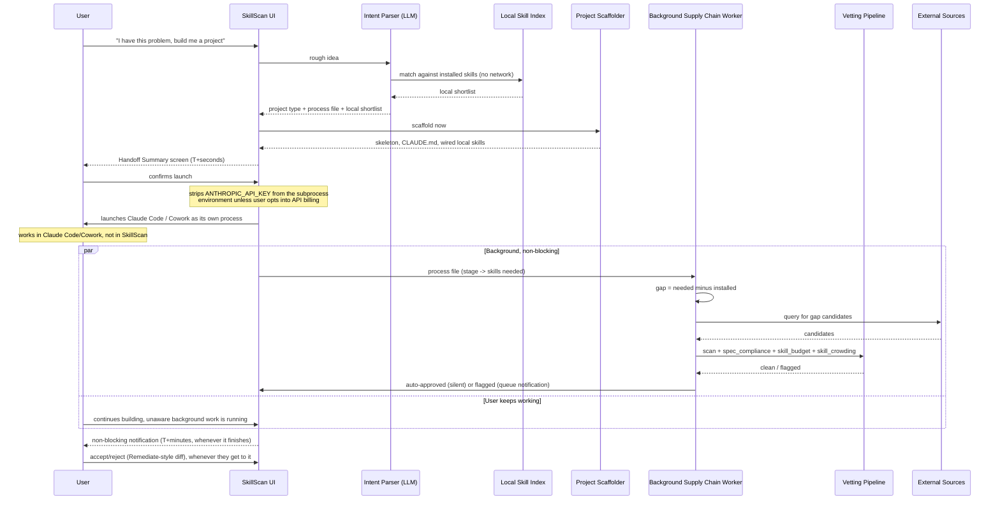

# Project Setup — Process Flow (draft, 2026-06-20)

> Drafted to drive the UI design for Project Setup / Skill Supply Chain (see
> [todo.md](todo.md) → "Project Setup & Skill Supply Chain"). Not yet built —
> this is the shape the implementation should follow, not a record of what
> exists. Core principle behind every decision below: the competing
> alternative is firing a rough prompt straight at Claude with zero setup —
> anything slower than that gets skipped, so the *user-facing* path must be
> fast even though the *real* work (sourcing, vetting) is not.

## 1. Swimlane view — what the user sees vs. what's happening underneath

```mermaid
flowchart TD
    Start(["User types a rough idea —<br/>'I have this problem...'"])

    subgraph UserFacing["USER-FACING — fast path, target: seconds"]
        Start --> Intent["Intent Parser — one LLM call<br/>infers project type, stack, process file,<br/>and a LOCAL-only skill shortlist (no network)"]
        Intent --> Scaffold["Project Scaffolder —<br/>skeleton, CLAUDE.md, settings.json,<br/>wires up the local skills found"]
        Scaffold --> Handoff["Handoff Summary screen —<br/>what got built, which skills wired in,<br/>launch action"]
        Handoff --> Launch(["SkillScan launches Claude Code / Cowork<br/>as its own process, then steps back"])
        Launch --> Notify{"Background result<br/>arrived?"}
        Notify -->|yes, non-blocking| Review["User reviews suggested additions —<br/>Remediate-style diff, accept/reject"]
        Notify -->|no| Continue(["User keeps working in Claude Code/Cowork,<br/>ignores it"])
    end

    subgraph Background["BACKGROUND — async, may take minutes, never blocks the user"]
        Intent -.->|"process file:<br/>stage to skills needed"| Gap["Gap Detection —<br/>needed vs. what got wired up locally"]
        Gap -->|gaps found| Source["Query external sources —<br/>GitHub / registries / agentskills.io"]
        Gap -->|no gaps| Done1(["Nothing to do"])
        Source --> Vet["Vetting Pipeline —<br/>scanner + spec_compliance +<br/>skill_budget + skill_crowding"]
        Vet -->|clean| AutoApprove["Auto-approve,<br/>wire in silently"]
        Vet -->|flagged| Surface["Surface to user —<br/>exception only, not the default path"]
        AutoApprove --> Log["Activity Log"]
        Surface --> Notify
        Log --> Notify
    end
```

**Why this shape, not a wizard:** every node in the User-Facing lane is a real screen or UI state — this maps directly onto what to design. Everything in the Background lane is plumbing the user should never have to wait on; it reports back via the *existing* notification pattern, not a new blocking dialog.

## 2. Timing view — making the speed argument explicit

The `par` block is the entire point of the diagram: the background lane and the user's continued work happen *at the same time*, not in sequence. The two-hour cost (network sourcing, multi-candidate vetting) becomes irrelevant to the user's experience because they were never waiting on it. The env-var note matters just as much: a key configured for SkillScan's own small internal calls must never leak into the launched subprocess, or it silently switches a subscribed user onto metered API billing for their entire session.

## 3. Stage-by-stage — mapping onto real and planned code

| Stage | What it does | Component |
|---|---|---|
| Intent Parser | Two LLM calls: infer project type/stack/plan, then match against what's already installed | **Built and tested 2026-06-20** — `core/intent_parser.py`. See todo.md for real findings from manual testing (plan inference works well; local matching needed two real bug fixes before it was trustworthy). |
| Project Scaffolder | Skeleton, `CLAUDE.md`, `.claude/settings.json`, license, CI config | Planned — Project Setup (todo.md). License picker already exists (`ui/_license_picker.py`) |
| Gap Detection | Diff process file's needed skills against what got wired up locally | Planned — new, but trivial given `core/skill_audit.py` already enumerates installed skills |
| External Sources | GitHub search / agentskills.io / registries | Planned — Phase 12 (todo.md), triggered by gap detection rather than manual browsing |
| Vetting Pipeline | Scanner + `core/spec_compliance.py` + `core/skill_budget.py` + `core/skill_crowding.py` | **Already built** — this stage reuses 100% existing code, nothing new to write |
| Auto-approve / Surface | Clean candidates wire in silently; only flagged ones interrupt the user | Planned — same Accept/Reject pattern already built for Remediate (`_RemediateDialog`) |
| Notification | Non-blocking "found N more skills" | Reuses the existing Activity Log + a dashboard-style notification, not a new mechanism |
| Handoff Summary | What got built, which skills wired in, launch action | New — the one genuinely new screen; strips `ANTHROPIC_API_KEY` from the launched subprocess's environment unless the user opts into API billing |
| Launch | Spawns Claude Code / Cowork as its own process, SkillScan steps back | New — simple subprocess launch, not an embedded console widget (avoids reimplementing terminal rendering) |

The encouraging finding from drafting this: the *hard* part (vetting) is already fully built, and the *visible* UI is genuinely small — three screens total (prompt entry, the existing Remediate-style approval dialog, and Handoff Summary). What's missing is almost entirely orchestration (the Intent Parser, the process file, the gap diff, the launch step) — not new detection logic, and not a large UI build either.

## Open questions this diagram surfaces, not yet answered

- ~~Where does the Intent Parser's "local shortlist" matching actually run~~ — **answered 2026-06-20**: a second LLM call reusing the skill-selection benchmark's exact name+description matching mechanism, not a separate simpler match. See todo.md for what testing it for real surfaced.
- What does the Handoff Summary screen actually render — a file tree, a chat-style summary, both?
- How many background notifications is too many before they become their own annoyance (same shared-budget problem `core/skill_budget.py` already deals with, one level up)?
- Does Cowork have an equivalent CLI/deep-link launcher to Claude Code's `claude` command? Unconfirmed — needs checking before the Launch stage can be designed concretely.
