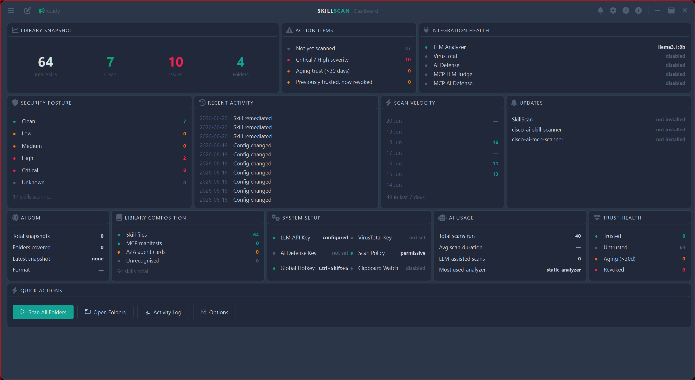

# SkillScan

**AI Skill Security Environment** — scan, audit, and govern every AI skill, MCP manifest, and A2A agent card on your machine.

SkillScan wraps the [Cisco AI Skill Scanner](https://github.com/cisco-ai-defense/cisco-ai-skill-scanner) and [MCP Scanner](https://github.com/cisco-ai-defense/cisco-ai-mcp-scanner) CLIs with a frameless, fully windowed PyQt6 environment — not just a tray utility.



---

## What It Does

AI skills (the instruction files that tell LLM agents what to do and what tools they can use) can contain malicious payloads: prompt injection, exfiltration instructions, or capability escalation. SkillScan surfaces these risks before a skill gets near a live agent.

Scan a skill folder, MCP manifest, or A2A agent card and get:
- **Severity rating** — CLEAN / LOW / MEDIUM / HIGH / CRITICAL
- **Structured findings** — category, description, line reference, remediation advice
- **LLM-powered analysis** — Anthropic Claude, OpenAI, or a local model via Ollama / any OpenAI-compatible server (LM Studio, vLLM, LocalAI) — no API costs required
- **Spec compliance scoring** against the [agentskills.io specification](https://agentskills.io/specification)

---

## Main views

| View | What it does |
|---|---|
| **Dashboard** | Card-grid overview — hero metrics, per-module AI provider/key status, security posture, action items, scan velocity, AI BOM, trust health |
| **Folders** | Browse watched folders as a tile grid with severity-coloured borders, trust badges, filter/sort/size controls, scan queue |
| **Skill Studio** | Package, validate, and remediate skill content against the agentskills.io spec — metadata form, SKILL.md editor, AI-assisted description optimisation and full review, spec-compliance scoring, build/save |
| **Skill Detail** | Deep-dive per skill: spec compliance, full HTML scan report, raw output, scan history with a severity sparkline, trust workflow (auto-revoked if the file changes on disk) |
| **Testing** | Download and manage the `cisco-ai-defense/skill-scanner` eval fixtures to verify your setup |
| **Activity Log** | Filterable, severity-coloured history of scans and trust changes |
| **Options** | General, LLM (independent provider selection per feature — Skill Studio vs. the scanner subprocess can each use a different provider simultaneously), Analyzers, MCP Scanner, Clipboard, Watched Folders, Skill Defaults, Software Updates. Every setting autosaves — no Save button |
| **About** | Version, current LLM providers per feature, credits |

Prompt Builder, Amalgamator, and Skill Competence Builder are reachable from the nav but not yet built (see [todo.md](.claude/architecture/todo.md)).

---

## Analyzers

- `cisco-ai-skill-scanner` — static analysis + trigger detection (SKILL.md / A2A)
- `cisco-ai-mcp-scanner` — static analysis for MCP manifests
- LLM analyzer — Anthropic, OpenAI, Ollama, or any OpenAI-compatible local server
- Behavioral pattern matching
- VirusTotal hash lookup (optional)
- Cisco AI Defense cloud analysis (optional)

## Background scanning

- Drag a skill folder onto the taskbar drop strip to scan instantly
- Clipboard auto-scan (configurable min-chars threshold, MD5 deduplication)
- Watched-folder auto-scan on SKILL.md change (watchdog, debounced)
- Optional HKCU Explorer right-click context menu (no admin required)
- System tray satellite — scan triggers, feature toggles, notifications; double-click to open the main window

---

## Requirements

- Windows 10/11
- Python 3.11+
- At least one LLM provider configured — an Anthropic/OpenAI API key, **or** a local Ollama/OpenAI-compatible server (no API key needed)

### Install

```powershell
cd C:\Users\stree\.claude\projects\skillscan
python -m venv .venv
.venv\Scripts\pip install -r requirements.txt
```

### Run

```powershell
.\run.ps1   # PowerShell
run.bat     # Command Prompt
```

or directly:

```powershell
.venv\Scripts\python -m skill_scan
```

---

## Configuration

Settings are stored at `%APPDATA%\SkillScan\config.json` — never in the repo. Open **Options** from the taskbar (gear icon) or the system tray — it's both a page in the main window and a floating window, and every change saves immediately. API keys are injected into the scanner subprocess via environment variables — never passed as CLI arguments, never logged.

---

## Eval fixtures

`evals/` contains test fixtures (SKILL.md / MCP manifest / A2A samples across attack categories, plus known-safe samples) sourced from `cisco-ai-defense/skill-scanner`, downloadable from the Testing view to verify your setup scans correctly. These are fixtures for SkillScan's own test workflow, not a skills library to scan against your real skills.

---

## Documentation

| Document | Contents |
|---|---|
| [.claude/architecture/architecture.md](.claude/architecture/architecture.md) | Component architecture, DB schema, LLM provider architecture, dashboard widget architecture, design patterns/decisions |
| [.claude/architecture/development.md](.claude/architecture/development.md) | Canonical roadmap — phases, planned feature areas, research items |
| [.claude/architecture/todo.md](.claude/architecture/todo.md) | Quick-reference outstanding work and known fixes |
| [.claude/architecture/handover.md](.claude/architecture/handover.md) | Session handover — regenerated each session |
| [.claude/architecture/change_history.md](.claude/architecture/change_history.md) | Chronological change log |
| [.claude/architecture/project_files.md](.claude/architecture/project_files.md) | File-by-file inventory |

---

## License

MIT
