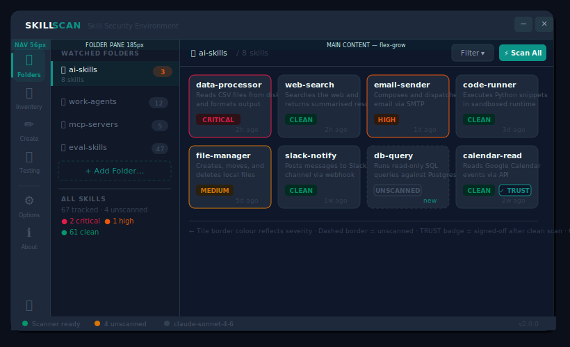

# SkillScan v2 — Architecture

> This document supersedes `Architecture.md` (v1 tray app).
> v2 transforms SkillScan from a system tray utility into a full **Skill Security Environment** — a windowed application for authoring, auditing, inventorying, and governing every AI skill, MCP manifest, and A2A agent card on the machine.
>
> Run: `.venv\Scripts\python -m skill_scan`

---

## Concept

The v1 tray app excelled at reactive scanning (drag-drop, clipboard, folder watch). v2 keeps all of that in the background and adds the proactive layer: a primary window where you can see, create, and understand every AI skill on the machine. The tray icon is retained as a satellite entry point for notifications and background triggers, but it is no longer the primary UX.

Three layers of capability:

| Layer | Question answered |
|---|---|
| **Security** (scan pipeline) | Is this skill safe to run? |
| **Inventory** (AI BOM) | What AI components do I have, where did they come from? |
| **Authoring** (Skill Creator) | Does this new skill conform to spec and pass before I deploy it? |

---

## Main Window Layout



The window is **frameless and borderless** — no native Windows chrome. Custom title bar carries the SKILLSCAN two-colour wordmark, a Segoe Fluent Icons minimise and close only (no maximise). Draggable via `mousePressEvent` / `mouseMoveEvent` on the title bar. Drop shadow via `QGraphicsDropShadowEffect` (blur 28, offset 0,6).

### Chrome geometry

| Zone | Width | Notes |
|---|---|---|
| Title bar | full × 40px | `#1E293B`, drag region, WM buttons right-aligned |
| Nav rail | 56px | `#1E293B`, icon + 8px label, active item has 3px left accent bar |
| Folder sub-pane | 185px (resizable) | `#111827`, folder list + stats |
| Main content | flex-grow | `#0F172A`, view-specific pane |
| Status bar | full × 24px | `#1E293B`, scanner state, unscanned count, LLM model, version |

### Nav rail items

| Item | Description |
|---|---|
| Folders | Primary view — folder list + skill tiles |
| Inventory | Table view of all tracked skills (AI BOM source) |
| Create | Skill Creator — metadata form + SKILL.md editor |
| Testing | Migrated from Settings → Testing tab |
| *(spacer)* | Visual separator |
| Options | Migrated from SettingsDialog |
| About | Migrated from AboutDialog |
| Exit | Bottom of rail — exits the application |

Active item: `#0D9488` icon + label, `rgba(13,148,136,0.12)` background, 3px left border bar in `#0D9488`.

---

## Component Architecture


### Input types

SkillScan v2 recognises three AI component file types:

| Type | Detection | Scanner used |
|---|---|---|
| **SKILL.md** | Filename match `SKILL.md` | `cisco-ai-skill-scanner` + DefenseClaw + LLM |
| **MCP Manifest** | JSON file containing `"mcpVersion"` or `"tools"` array at root | Adapted pipeline; triggers tool-description injection checks |
| **A2A Agent Card** | JSON at `agent.json` or `.well-known/agent.json` with `"capabilities"` key | Adapted pipeline; checks capability scope and permission escalation |

The **File Type Router** (`core/router.py`) inspects each path before dispatching to the scan pipeline. Unknown file types are flagged but not scanned.

### Scan pipeline (per component)

Analyzers run in parallel where possible; results are merged into a single `ScanResult`:

1. `cisco-ai-skill-scanner` — static + trigger detection (always enabled for SKILL.md)
2. **DefenseClaw** (`integrations/defenseclaw.py`) — Cisco AI Defense deep analysis
3. **LLM Analyzer** — LiteLLM call with structured prompt; requires API key
4. **Behavioral** — heuristic pattern matching
5. **VirusTotal** — hash lookup for binary attachments; requires API key
6. **Trigger Detection** — explicit trigger/payload pattern matching

### AI BOM Generator

After each scan (or on-demand from the Inventory view), `integrations/aibom.py` generates a BOM entry for the component:

```json
{
  "bomFormat": "CycloneDX",
  "specVersion": "1.6",
  "version": 1,
  "components": [{
    "type": "machine-learning-model",
    "name": "web-search",
    "version": "1.0.0",
    "authors": [...],
    "licenses": [...],
    "externalReferences": [...],
    "properties": [
      { "name": "skillscan:spec_type", "value": "SKILL.md" },
      { "name": "skillscan:scan_severity", "value": "clean" },
      { "name": "skillscan:scan_timestamp", "value": "2026-06-13T..." },
      { "name": "skillscan:trusted", "value": "true" }
    ]
  }]
}
```

Folder-level BOM snapshots aggregate all components in that folder into a single CycloneDX document and are stored in `bom_snapshots` with a timestamp.

---

## Project Structure

```
SkillScan/
├── run.ps1
├── run.bat
└── skill_scan/
    ├── __init__.py                     # __version__ = "2.0.0"
    ├── __main__.py                     # Entry: QApplication, MainWindow, TrayApp (satellite)
    ├── core/
    │   ├── config.py                   # JSON config — load() / save() (unchanged)
    │   ├── scanner.py                  # ScanJob — QProcess wrapper (unchanged)
    │   ├── router.py                   # NEW — file type detection, dispatcher
    │   ├── db.py                       # NEW — SQLAlchemy engine, migrations, session factory
    │   ├── skill_discovery.py          # NEW — walk folders, populate DB, hash-check deletions
    │   ├── bom_generator.py            # NEW — CycloneDX BOM assembly from DB records
    │   ├── result_store.py             # Retained — migrates JSON history into DB on first run
    │   ├── clipboard_watcher.py        # Retained (unchanged)
    │   ├── watcher.py                  # Retained (unchanged)
    │   └── test_skills.py              # Retained (unchanged)
    ├── ui/
    │   ├── _palette.py                 # Colour tokens (unchanged)
    │   ├── _widgets.py                 # RoundedCard, TitleBar, card_divider, SCROLLBAR_STYLE
    │   ├── main_window.py              # NEW — frameless QMainWindow, nav rail, QStackedWidget
    │   ├── nav_rail.py                 # NEW — NavRail QWidget, NavItem, active-state management
    │   ├── scan_progress.py            # Retained — frameless scan dialog (unchanged)
    │   ├── result_formatter.py         # Retained — HTML findings report (unchanged)
    │   ├── tray.py                     # Retained — satellite tray (simplified; no Settings launch)
    │   ├── toggle_row.py               # Retained — animated pill toggle (unchanged)
    │   └── views/
    │       ├── folders_view.py         # NEW — QSplitter: FolderPane + SkillTileGrid
    │       ├── skill_detail_view.py    # NEW — single skill: spec score, scan report, history
    │       ├── inventory_view.py       # NEW — QTableView over all tracked skills; BOM export
    │       ├── skill_creator_view.py   # NEW — metadata form + SKILL.md editor + AI Review
    │       ├── testing_view.py         # MIGRATED from settings_dialog._make_testing_tab()
    │       ├── options_view.py         # MIGRATED from SettingsDialog
    │       └── about_view.py           # MIGRATED from AboutDialog
    ├── integrations/
    │   ├── defenseclaw.py              # NEW — DefenseClaw subprocess wrapper + result parser
    │   ├── aibom.py                    # NEW — CycloneDX BOM generation + export
    │   ├── agentskills_spec.py         # NEW — agentskills.io JSON Schema validator
    │   └── mcp_a2a.py                  # NEW — MCP / A2A manifest detection and scan adapter
    └── windows/
        ├── taskbar_dock.py             # Retained — drag-drop strip (unchanged)
        └── context_menu.py             # Retained — optional HKCU install (unchanged)
```

---

## Database Schema

SQLite database at `%APPDATA%\SkillScan\skillscan.db`, managed via SQLAlchemy. Existing `results.json` is migrated into `scan_results` on first run.

### `folders`

| Column | Type | Notes |
|---|---|---|
| `id` | INTEGER PK | |
| `path` | TEXT UNIQUE | Absolute path |
| `watch_enabled` | BOOLEAN | Drives FolderWatcher |
| `last_scanned` | DATETIME | Set after "Scan All" completes |
| `added_at` | DATETIME | |

### `skills`

| Column | Type | Notes |
|---|---|---|
| `id` | INTEGER PK | |
| `folder_id` | FK → folders | |
| `path` | TEXT UNIQUE | Absolute path to SKILL.md / manifest |
| `name` | TEXT | Parsed from metadata or filename |
| `spec_type` | TEXT | `skill` / `mcp` / `a2a` / `unknown` |
| `version` | TEXT | From metadata, nullable |
| `authors` | TEXT | JSON array string |
| `license` | TEXT | SPDX identifier or raw string |
| `description` | TEXT | From metadata |
| `file_hash` | TEXT | SHA-256 of file content; invalidates trust on change |
| `trusted` | BOOLEAN | Set true by user after clean scan |
| `trust_signed_at` | DATETIME | When trust was granted |
| `spec_score` | INTEGER | 0–100 agentskills.io compliance |
| `created_at` | DATETIME | First seen by SkillScan |
| `modified_at` | DATETIME | Last file-system modification |

### `scan_results`

| Column | Type | Notes |
|---|---|---|
| `id` | INTEGER PK | |
| `skill_id` | FK → skills | |
| `timestamp` | DATETIME | |
| `severity` | TEXT | `clean` / `low` / `medium` / `high` / `critical` / `unknown` |
| `is_safe` | BOOLEAN | |
| `raw_json` | TEXT | Full scanner output |
| `findings_json` | TEXT | Parsed findings array |
| `duration_ms` | INTEGER | Wall time for full scan pipeline |
| `analyzers_used` | TEXT | JSON array of analyzer names run |
| `returncode` | INTEGER | Exit code |

### `bom_snapshots`

| Column | Type | Notes |
|---|---|---|
| `id` | INTEGER PK | |
| `folder_id` | FK → folders | NULL = whole-library snapshot |
| `created_at` | DATETIME | |
| `format` | TEXT | `cyclonedx-json` / `spdx-json` |
| `content` | TEXT | Full BOM document |

---

## Integration Architecture

### DefenseClaw (`integrations/defenseclaw.py`)

Wraps the `defenseclaw` CLI in a `QProcess` (same pattern as `scanner.py`). Findings are parsed and normalised into the shared `Finding` schema before being merged with `cisco-ai-skill-scanner` output. Enabled via checkbox in Options → Analyzers. Requires `defenseclaw` installed in the same venv.

```
defenseclaw scan <path> --format json
→ stdout JSON → _parse_defenseclaw(stdout) → list[Finding]
→ merged into ScanResult.findings
```

### agentskills.io Spec Validator (`integrations/agentskills_spec.py`)

Downloads the agentskills.io JSON Schema on first use (cached to `%APPDATA%\SkillScan\spec_cache\`). Validates SKILL.md frontmatter fields against the schema using `jsonschema`. Returns a `SpecResult(score: int, missing: list, warnings: list)`. Score drives the compliance badge in Skill Detail view and the `spec_score` DB column.

### MCP / A2A Adapter (`integrations/mcp_a2a.py`)

MCP manifests and A2A agent cards do not use `cisco-ai-skill-scanner` (which expects SKILL.md format). Instead, the adapter:

1. Extracts tool descriptions / capability declarations as text
2. Assembles a synthetic `SKILL.md`-like prompt context
3. Passes it to the LLM Analyzer and Trigger Detector only
4. Returns findings tagged with `source: mcp` or `source: a2a`

### AI BOM (`integrations/aibom.py`)

Reads skill metadata + latest scan result from the DB and assembles a CycloneDX 1.6 ML BOM document. Export formats: `cyclonedx-json`, `cyclonedx-xml`, `spdx-json`. The Inventory view's "Export BOM" button triggers a folder-scoped or library-scoped export with a file-save dialog.

BOM diff: compares two `bom_snapshots` by component name+version, produces an `added / removed / changed` summary shown in a modal dialog.

---

## Design Language

Defined in `ui/_palette.py`. All colours are accessed via named tokens — no hardcoded hex in UI files.

| Role | Token | Hex | Usage |
|---|---|---|---|
| Canvas | `ANCHOR` | `#0F172A` | Window bg, main content, cards |
| Structure | `DEEP_SURFACE` | `#1E293B` | Title bar, nav rail, toolbar, sub-panes |
| Dividers | `DIVIDER` | `#243846` | All `QFrame` separators |
| Primary text | `LIGHT_CANVAS` | `#F0FDFA` | Headings, tile names |
| Secondary text | `MUTED_TEXT` | `#475569` | Subtitles, dates, labels |
| CTA | `ACCENT` | `#0D9488` | Scan All button, active nav, links |
| Hover | `HOVER_FOCUS` | `#0F766E` | Button hover state |
| Accent text | `SOFT_SURFACE` | `#CCFBF1` | Remediation text, spec score |
| Critical | `CRITICAL_ACCENT` | `#E11D48` | Tile border, badge |
| High | `HIGH_ACCENT` | `#EA580C` | Tile border, badge |
| Medium | `MEDIUM_ACCENT` | `#D97706` | Tile border, badge |
| Clean | `SAFE_ACCENT` | `#059669` | Tile border, badge |
| Trust | `ACCENT` | `#0D9488` | Trust badge border + text |

Frameless window pattern: `FramelessWindowHint` + `WA_TranslucentBackground`, `QPainterPath.addRoundedRect` in `paintEvent`, `QGraphicsDropShadowEffect` (blur=28, offset=(0,6)). Shared base in `_widgets.py`.

---

## PyQt6 Patterns

### Patterns retained from v1

All patterns from `Architecture.md` §PyQt6 Patterns carry forward unchanged:
- `QProcess`-based async scanning
- `QPropertyAnimation` pill toggle
- Clipboard watcher MD5 deduplication
- Folder watcher walk-up debounce
- Frameless dialogs (`RoundedCard` + `TitleBar`)

### New patterns for v2

**Nav-driven pane switching**
`QStackedWidget` holds one widget per nav item. `NavRail` emits `page_changed(int)`. `MainWindow` connects this to `QStackedWidget.setCurrentIndex()`. No state is lost when switching panes; each view manages its own lazy-load.

```python
self._stack.setCurrentIndex(index)   # instant, no animation needed
```

**Skill tile grid**
`SkillTileGrid` is a `QWidget` with a `QFlowLayout` (or `QGridLayout` with fixed column count). Each `SkillTile` is a `QFrame` subclass. Tiles are populated from the DB on `folder_selected(folder_id)` signal. Hover state changes border colour via `enterEvent` / `leaveEvent` + `update()`. Click emits `skill_selected(skill_id)` which pushes `SkillDetailView` onto the stack and shows a back button in the title bar.

**Back navigation**
`MainWindow` keeps a `_history: list[int]` stack. Navigating to a skill detail view pushes the current stack index. The back button (shown in title bar when `_history` is non-empty) calls `_stack.setCurrentIndex(_history.pop())`.

**SQLAlchemy session scoping**
All DB reads use a short-lived `Session` via context manager. Long-running writes (discovery scan, BOM generation) run in a `QThread` worker, commit on the thread, then emit a `finished` signal for the UI to refresh.

```python
with db.session() as s:
    skills = s.query(Skill).filter_by(folder_id=fid).all()
```

**Spec validator async**
`agentskills_spec.py` fetches the schema from the network on first use. This runs in a `QThread` so the Skill Creator pane does not block. A `QLabel` shows "Validating…" while the thread runs; on `finished`, it updates the score badge.

**Trust invalidation via file hash**
`SkillDiscovery` computes SHA-256 on each file during folder refresh. If `file_hash` differs from the DB value, `trusted` is set `False` and `trust_signed_at` is cleared. The tile badge updates on next load. No user action required.

**Scrollbar styling**
Qt's `QScrollBar` stylesheet rules do **not** cascade from a parent widget's `setStyleSheet()` into child scrollbar widgets. The standard scrollbar style must be applied **directly** on the scrollbar widget itself:

```python
from .._widgets import SCROLLBAR_STYLE

# CORRECT — apply directly to the scrollbar widget
widget.verticalScrollBar().setStyleSheet(SCROLLBAR_STYLE)

# WRONG — QScrollBar rules silently ignored when set on the parent
widget.setStyleSheet(f"QTextBrowser{{...}}" + SCROLLBAR_STYLE)   # ❌
scroll_area.setStyleSheet(f"background:{ANCHOR};" + SCROLLBAR_STYLE)  # ❌
```

`SCROLLBAR_STYLE` is the single source of truth — defined in `ui/_widgets.py`. All scrollable widgets in the app must use this constant. The style renders a 6px slim dark handle (`#334155`) on a transparent track with no arrow buttons — consistent with the dark palette throughout.

Applies to: `QTextBrowser`, `QPlainTextEdit`, `QListWidget`, `QScrollArea` (call on `.verticalScrollBar()`), and any other widget with an internal scrollbar.

---

## Key Design Decisions

| Decision | Rationale |
|---|---|
| Window-first, tray as satellite | Tray-only UX limits discoverability and makes skill authoring/inventory impossible; tray retained for background triggers and notifications |
| No native title bar | Consistent with existing frameless dialogs (`ScanProgressDialog`, `AboutDialog`); avoids Windows title bar theming conflicts with dark palette |
| No Maximise button | Fixed-proportion layout; maximised window would leave awkward whitespace in tile grid; resizable handles are sufficient |
| SQLite over JSON result store | Enables relational queries (skills per folder, history per skill, BOM snapshots); `result_store.py` JSON migrated in on first run |
| SHA-256 hash for trust invalidation | File content change = trust revoked automatically; prevents stale trust badges after silent edits |
| CycloneDX 1.6 ML BOM format | Industry standard for AI/ML inventory; tooling ecosystem (SBOM viewers, compliance scanners) already supports it |
| Separate `integrations/` package | DefenseClaw, aibom, agentskills_spec each have distinct install requirements and may not be available; keeping them isolated lets the app degrade gracefully if a dependency is missing |
| MCP/A2A via synthetic skill context | Avoids forking the scan pipeline; routes non-SKILL.md types through the same LLM/Trigger analyzers with adapted prompt context |
| `QFlowLayout` for tiles | Tiles reflow naturally on resize; fixed grid column count would leave orphan whitespace at different window widths |
| Lazy view loading | Each nav view is instantiated on first visit, not at startup; keeps startup time fast even as the number of views grows |
| Tray simplified in v2 | Tray menu loses Settings (→ Options nav item) and About (→ About nav item); retains scan triggers, feature toggles, and notifications only |
